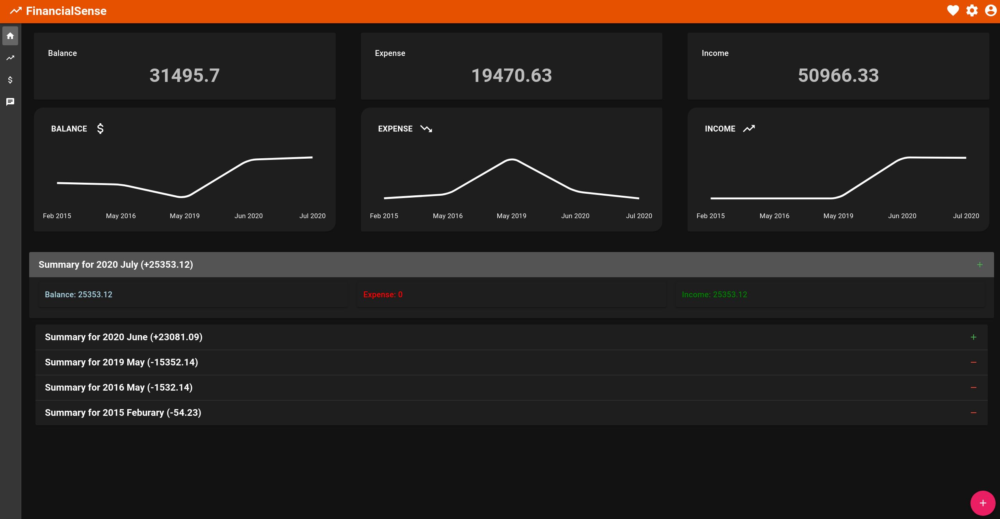
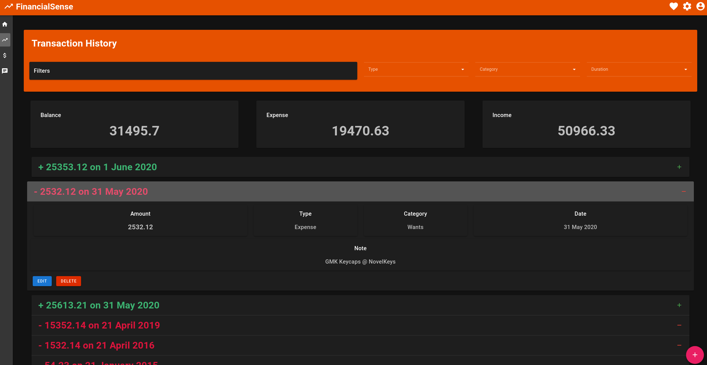

# FinancialSense

## About
FinancialSense is a financial tracker with beautiful dashbaords aimed at helping users get an easier overview of their expenditure and aid in saving money

## Setting up the project

```bash
# clone the repository
$ git clone git@github.com:nhzaci/FinancialSense

# install dependencies
$ npm install

# serve with hot reload at localhost:8080
$ npm run dev

# build for production and launch server
$ npm run build
$ npm run start

# generate static project
$ npm run generate
```

The project goes along with the back end API FinancialSenseExpress, which is available [here](https://github.com/nhzaci/FinancialSenseExpress).

### TODO:

* User authentication to be tied up to back end to complete application

## Screenshots

### Home Page


### Tracking Page


### Adding Transactions


### Editing Transactions


### Expand-on-hover Nav Drawer


### Tooltipped App Bar Icons


